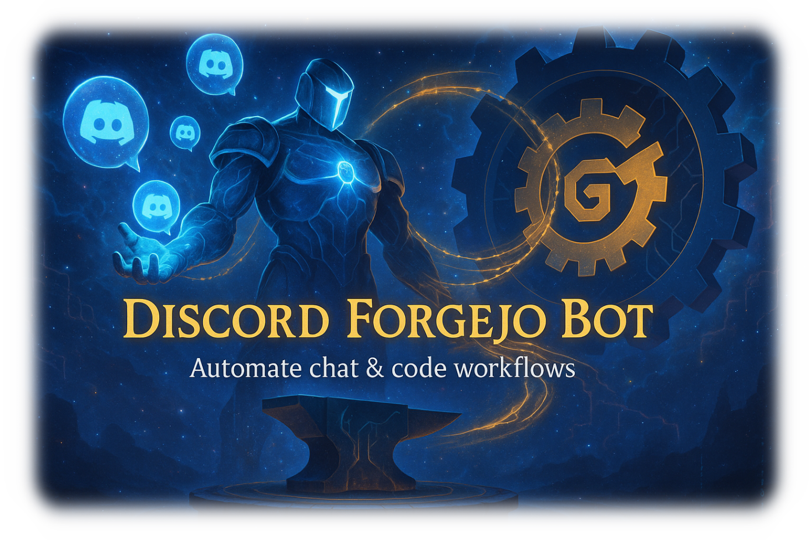

<div align="center">
  
  <h1>discord-forgejo-bot</h1>
  <p>
    
    
    
  </p>
</div>

## 🚀 概要
ForgejoとDiscordを連携するBotです。プルリクやIssueの通知をDiscordに送信します。  
さらに、**Discordのスラッシュコマンド（`/issue`）でForgejoにIssueを作成することも可能です。**

## 📦 Dockerでの起動

```sh
git clone https://github.com/yourname/discord-forgejo-bot.git
cd discord-forgejo-bot
cp .env.example .env
# .envを編集して各種トークンやURLを設定
docker-compose up -d
```

- Flaskサーバはデフォルトでポート5000で待ち受けます（`.env`で変更可）。
- ForgejoのWebhookに `http://<サーバーIP>:5000/webhook/forgejo` を設定してください。

## ⚙️ 必要な環境変数

`.env.example` を参照してください。主な変数は以下の通りです。

- `DISCORD_TOKEN` ... Discord Botのトークン
- `FORGEJO_URL` ... ForgejoのURL（例: https://git.example.com）
- `FORGEJO_TOKEN` ... Forgejo APIトークン
- `REPO_OWNER` ... リポジトリオーナー
- `REPO_NAME` ... リポジトリ名
- `DISCORD_CHANNEL_ID` ... デフォルト通知チャンネルID（リポジトリ専用チャンネルが未設定の場合のフォールバック）
- `WEBHOOK_SECRET` ... Webhookシークレット（任意）

## 📝 使い方

1. Discord Developer PortalでBotを作成し、トークンを取得
2. `.env` ファイルに各種トークンやURLを設定
3. DockerでBotを起動
4. ForgejoのWebhookを設定し、Discord通知を受け取る

### 💡 DiscordからForgejoにIssueを作成する

Discordのスラッシュコマンド `/issue` を使って、ForgejoにIssueを作成できます。

例:
```
/issue タイトル: バグ報告 本文: ボタンが動作しません
```

### 📋 リポジトリ別チャンネル通知設定

各リポジトリの通知を専用チャンネルに送信できます。

#### リポジトリチャンネルを設定
```
/set_repo_channel repository: owner/repo-name channel: #repo-channel
```

#### リポジトリチャンネル一覧を表示
```
/list_repo_channels
```

#### 🔄 通知の仕組み
- 各リポジトリの通知は設定された専用チャンネルに送信されます
- リポジトリが未設定の場合は、デフォルトチャンネル（`DISCORD_CHANNEL_ID`）にフォールバックします
- Issue通知はリポジトリごとに専用スレッドで管理されます

## 🗂️ ディレクトリ構成（機能別フォルダ構成）

```
forgejo_discord_bot/
  ├── __init__.py
  ├── __main__.py
  ├── bot.py              # 後方互換性エントリーポイント
  ├── cli.py              # CLI関連
  ├── webhook.py          # 後方互換性エントリーポイント
  ├── core/               # 🔧 コア機能
  │   ├── __init__.py
  │   └── bot.py          # メインBot設定とイベントハンドラー
  ├── discord/            # 💬 Discord関連機能
  │   ├── __init__.py
  │   ├── commands.py     # スラッシュコマンド管理
  │   └── notifications.py # Discord通知機能
  ├── forgejo/            # 🔗 Forgejo連携
  │   ├── __init__.py
  │   └── api.py          # Forgejo API連携
  ├── database/           # 🗃️ データベース操作
  │   ├── __init__.py
  │   └── models.py       # PostgreSQL操作とモデル
  └── web/                # 🌐 Web関連
      ├── __init__.py
      └── webhook.py      # Webhook処理
docker-compose.yml
Dockerfile
.env.example
README.md
```

### 📁 新しいフォルダ構成の説明

#### 🔧 core/ - コア機能
- **bot.py**: Discord Botのメイン設定、イベントハンドラー

#### 💬 discord/ - Discord関連機能
- **commands.py**: スラッシュコマンドの定義と実装
- **notifications.py**: Issue/コメント通知のDiscord送信処理

#### 🔗 forgejo/ - Forgejo連携
- **api.py**: Forgejo APIとの通信処理

#### 🗃️ database/ - データベース操作
- **models.py**: PostgreSQL関連の全操作（接続、テーブル作成、CRUD）

#### 🌐 web/ - Web関連
- **webhook.py**: ForgejoからのWebhook受信処理

### 🎯 リファクタリングの効果
- **運用性向上**: 機能別の明確な分離で保守が容易
- **可読性向上**: フォルダ構成で機能が一目でわかる
- **拡張性**: 新機能は適切なフォルダに配置
- **テスト性**: 各モジュールの独立性によりテストが容易

## 📁 サンプル
サンプルBotや設定例は [example/README.md](./example/README.md) を参照してください。

## 🖼️ スクリーンショット
<!-- 必要に応じて動作例の画像をここに追加 -->

## 📝 ライセンス
本プロジェクトはMITライセンスです。
## インストール

依存パッケージはすべて `pyproject.toml` で管理されています。
以下のコマンドでパッケージと依存関係をまとめてインストールできます。

```sh
pip install .
```
